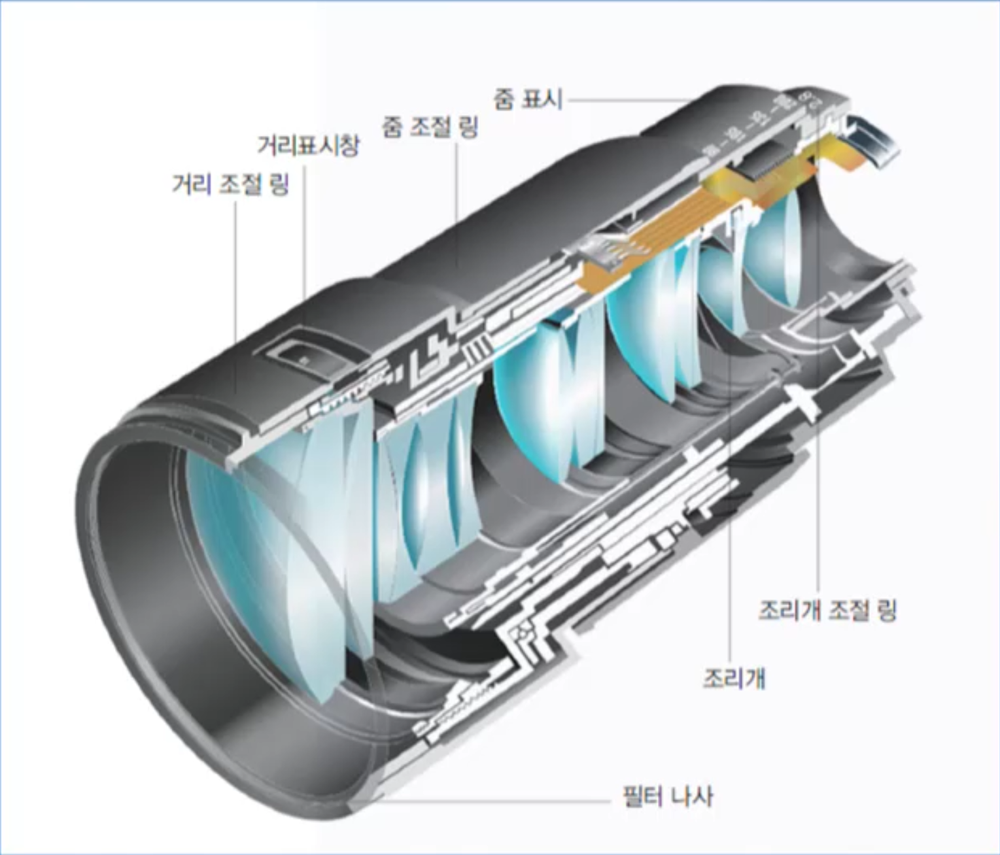
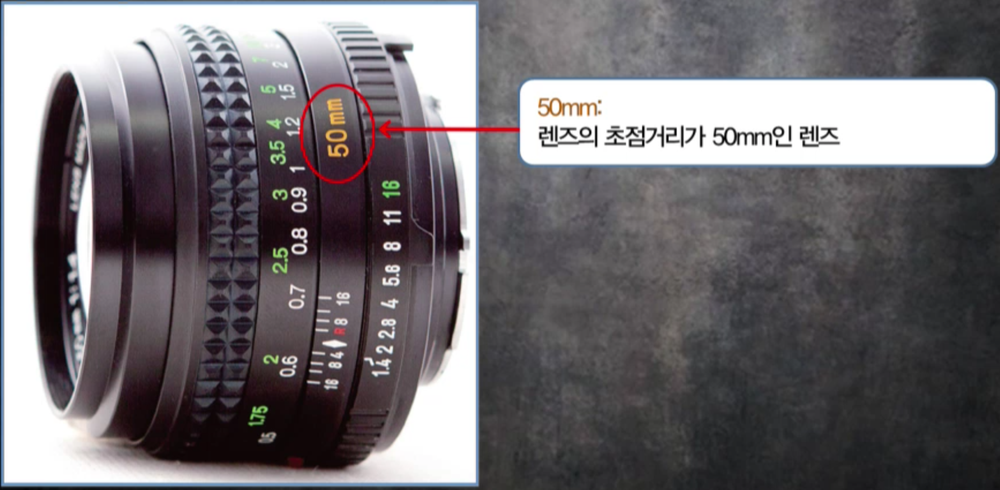
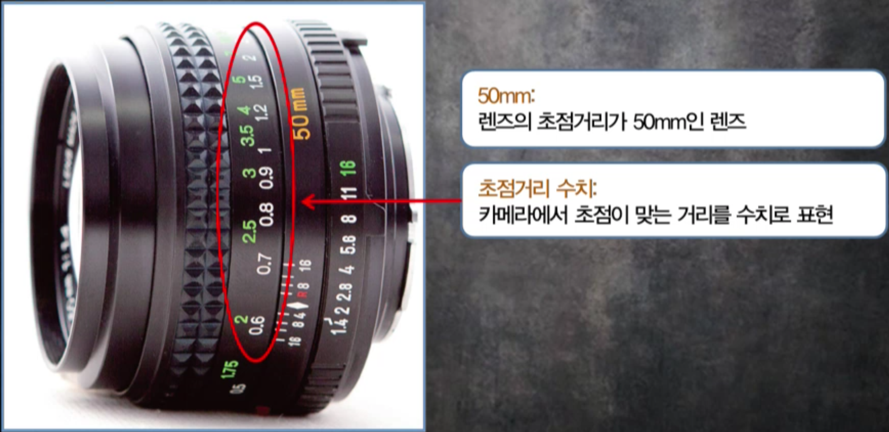
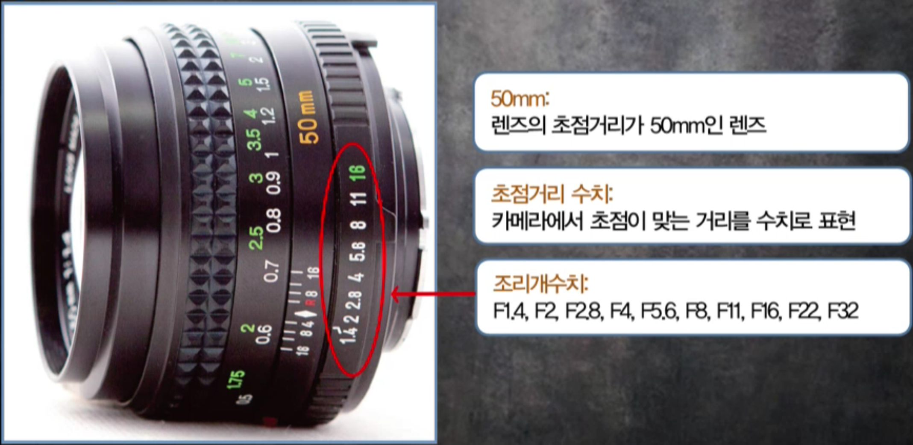
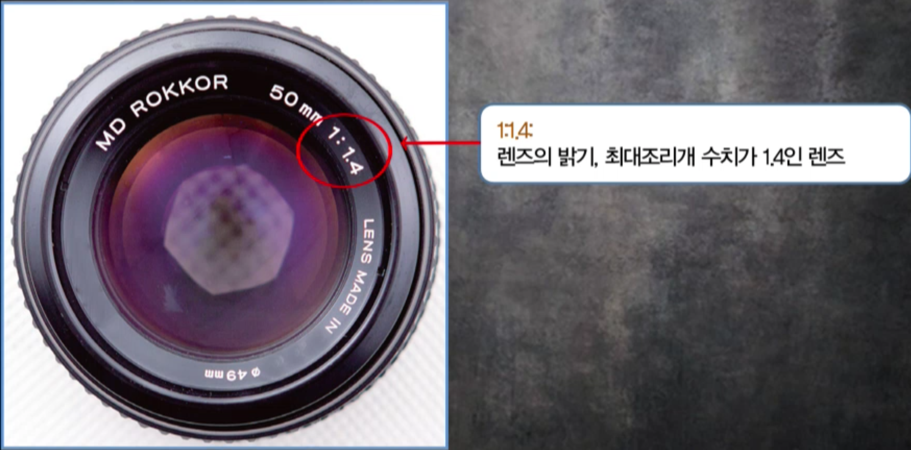
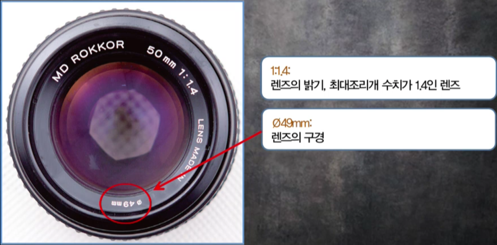
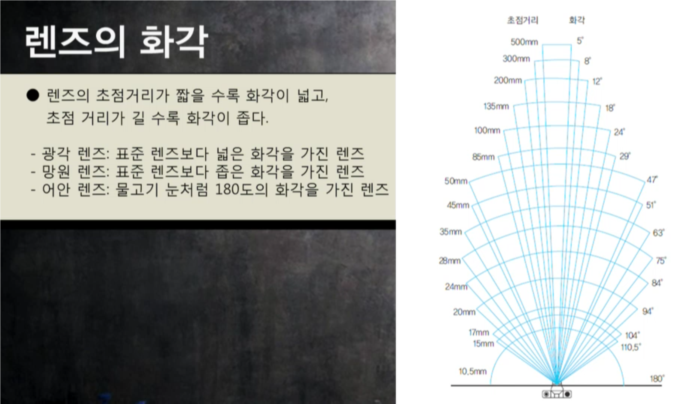
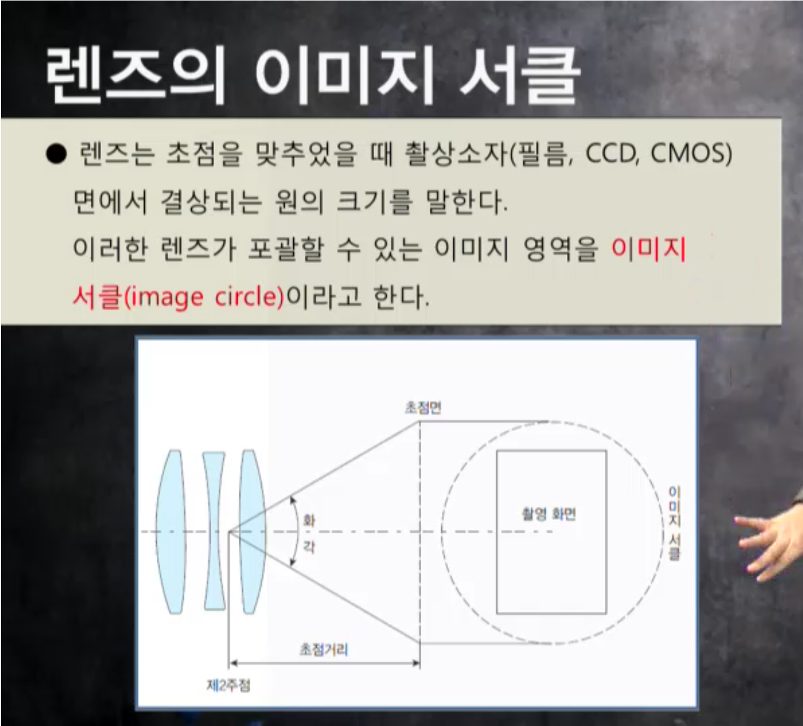

# 렌지의구조와 원리
렌즈
* 빛을 투과, 반사, 분산 시키면서 빛을 촬상소자 필름에 전달하는 도구
* 빛을 모아주는 볼록 랜즈와 빛을 퍼지게 하는 오목렌즈로 구성되어 상을 형성
* 볼록렌즈는 빛을 모아주지만 주변부가 흐려지기 떄문에 오목렌즈와 함께 사용

카메라 렌즈: 여러장의 렌즈로 구성되어 빛을 모으고 결상면을 만들어 촬상소자(필름, CCD, CMOS)면에 선명한 화상을 만드는데 도움을 주는 도구

렌즈의 중심부 부터 필름면(CCD) 까지 거리

망원렌즈: 초점거리가 긴 렌즈 
광각렌즈: 초점거리가 짧은 렌즈

수치가 작으면 작을 수록 더 많은 빛의 양을 받아드릴수 있음 (밝은 렌즈 선호 = 어두운 곳에서도 잘 찍힘) 

렌즈 구경 : 초점거리 

(1)       : (1.4)
 

## 수차와 비구면 렌즈
* 수차(aberration)는 볼록 렌즈의 주변부로 들어오는 빛과 중심부로 들어오는 빛이 동일한 각도로 꺽이면서 한 점으로 결상되지 않을 때 생기는 블러 현상을 만한다.
* 수차는 해상도 및 컬러에 부정적인 영향을 준다. 이러한 수차를 줄이기 위해 주리개를 조여서 렌즈의 중심부를 사용하여 수차를 줄여주게 된다.
* 조리개가 좁으면 수차가 적어짐

## 렌즈코팅
코팅하면 수차를 줄여줌
빛의 투과를 도와줌

초점거리에 따라 보여지는 화각이 달라짐

## 조리개
빛의 양을 줄여줌
* 렌즈의 중간 부분에 설치된 장치로 촬영소자에 들어가는 빛의 양을 조절
* 초승달 모양의 앏은 철판을 여러 장 겹쳐 원형으로 구성되어 크기가 조절
* 피사계 심도, 수차, 렌즈로 들어오는 빛의 양을 조절

조리계 수치: F1.4, F2, F2.8, F4, F5.6, F8, F11, F16, F22, F32, F45
* 모든 카메라가 동일한 수치를 가짐

* F5.6, F8, F11 가장 해상도가 높음

* 조리계가 많이 열려 있으면 해상도가 낮게 나오고 적절히 열려 있으면 높게 나온다.

## 피사계 심도

피사계 심도(depth of field) : 어느 한 지점에 초점을  조절했을 때 전방과 후방으로 초점이 맞는 범위

피사계 심도 조절 변수

| 심도 조절 변수 | 피사계 심도 범위가 넓다 | 피사계 심도 범위가 좁다|
|---------------|------------------------|-----------------------|
| 카메라와 피사체의 거리| 멀다 | 짧다 |
| 렌즈의 초점거리 | 짧다 | 길다 |
| 조리개 수치 | 높다 | 낮다 |
| 촬상소자의 크기 | 작다 | 크다 |

피사계 심도에 따라 보는 사람의 보는 순서를 바꿀 수도 있다

## 단 렌즈와 줌 렌즈
단 렌즈 : 초점거리가 하나인 렌즈
줌 렌즈 : 초점거리가 여러개인 렌즈
| 구분 | 장점 | 단점 |
|-----|-------|-----|
| 단 렌즈 | 줌 렌즈에 배해 고화질이고 렌즈의 밝기가 밝다 | 초점거리 조절이 되지 않기 때문에 초점을 맞추는데 불편하다 |
| 줌 렌즈 | 정해진 범위에서 줌이 자유롭게 변형되어 촬영이 용이하다 | 단 렌즈에 비해 화질이 떨어지고 렌즈 밝기가 어둡다 |

렌즈의 종류

표준렌즈 : 인간의 육안과 가장 비슷한 화상의 크기와 원근감을 가지는 가장 일반적인 렌즈 이다.

광각렌즈: 화각이 넓은 렌즈로 비교적 피사계 심도가 깊고 원금감이 과장되는 효과를가진다

망원렌즈: 가까이에서 촬영하기 힘든 경우 주로 촬영한다. 원금감이 압축되어 보여 비교적 거리보다 물체간의 거리가 가까워 보이는 현상을 보인다.

마크로 렌즈(macro): 근접 접사 촬영을 위해 특수 설계된 렌즈를 말한다 짧은 거리에 있는 사물을 촬영하는데 용이하다

TS 렌즈, PC 렌즈

TS 렌즈(tilt-shift lens)는 틸트 시프트가 가능한 렌즈를 말한다. 제조사에 따라 동일한 기능을 하는 렌즈로 PC(perspectice control lens)렌즈라고도 한다.

=> TS,PC렌즈는 대형 카메라의 무브먼트 기능을 가지고 있는 렌즈로 초점면의 조절 혹은 라이즈 폴이 가능한 경우도 있다.

연초점 렌즈: 고의로 수차를 만들어 상의 선명도를 흐리게 만들어 부드러운 화상을 만들도록 설계된 렌즈를 말한다. 렌즈에 따라 흐림의 정도를 조절할 수 있도록 제작된 것들도 있다.

렌즈후드: 렌즈로 들어오는 불필요한 빛을 차단해주는 역활을 하는 장비

필터: 렌즈 앞에 끼우는 것으로, 쉽게 생각하면 선글라스와 같은 효과를 나타낸다.

UV(ultra vilot) 필터: 무색의 필터로 자외선을 차단해 화상의 선명도를 돕는 필터를 말한다. 단파장의 경우 대기 중의 먼지 수분으로 인해 빛이 산란된다. 이러한 산란광을 제어하는 데 도움이 된다. 해즈컷 필터라고 한다.

PL(polarization) 필터: 편광 필터로 빛을 걸러주는 역활을 한다. 유리나 수면에 반사에 비친 빛을 차단하여 제어하는 것이 가능한다. 컬러 사진은 색 콘트라스트를 높여 주는 것이 가능하다. CPL(circular polarzation) 은 원형으로 빛을 걸러주어 자동 초점을 맞게 하는데 도움을 주는 편광 필터 이다.

익스텐션: 초점거리를 늘려서 사용하는 렌즈의 초점거리를 다르게 만드는 장치를 말한다.

삼각대: 렌즈나 카메라에 부착하여 촬영하여 흔들림을 방치하는 장비 이다.
