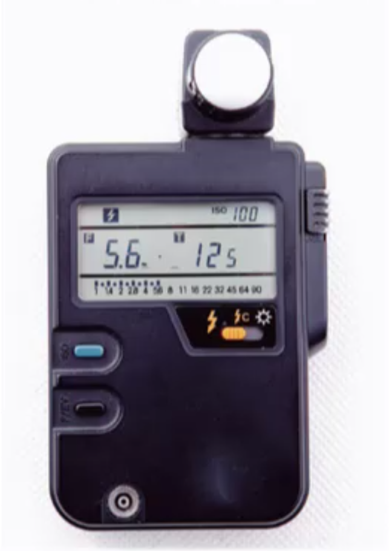
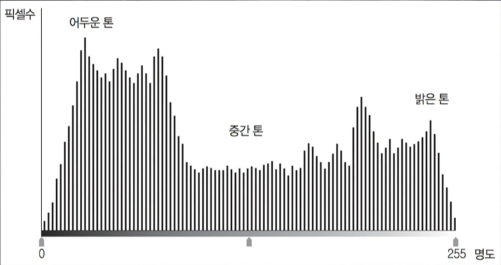
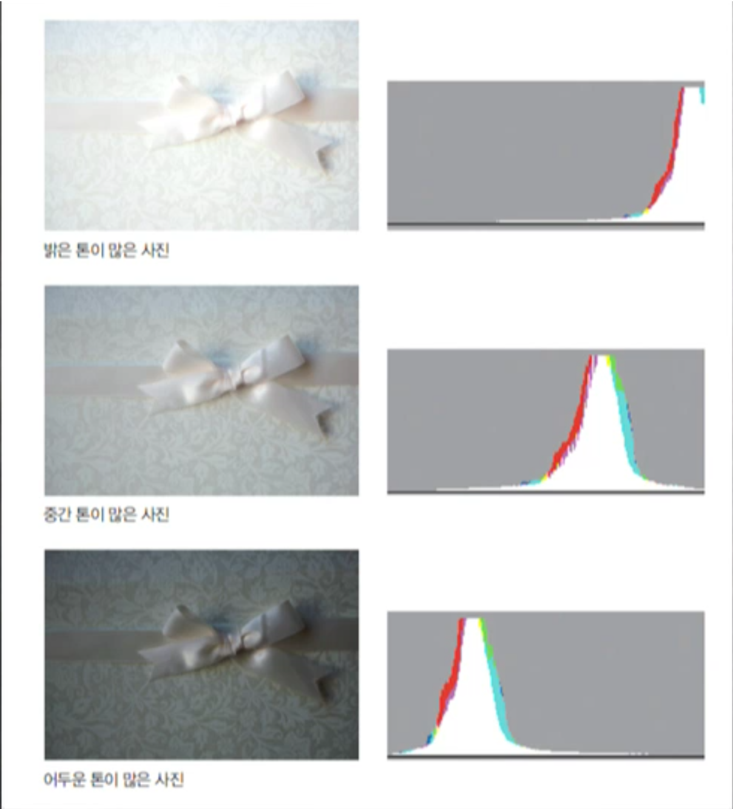
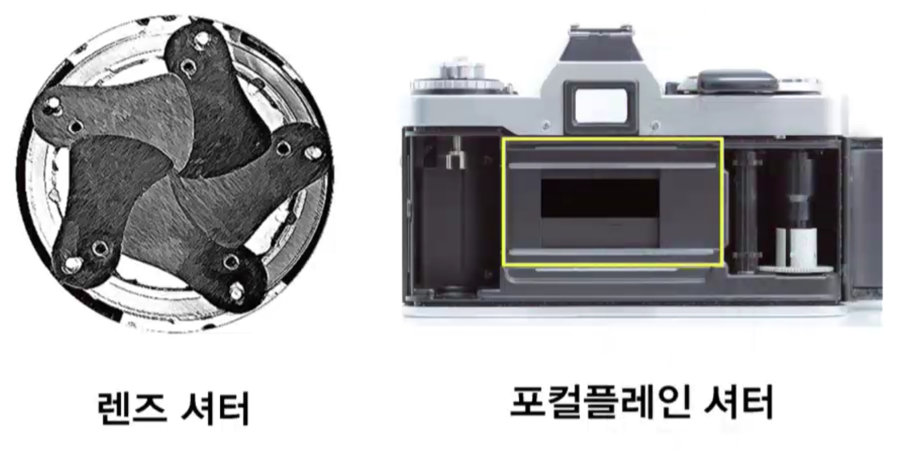

# 노출(exposure
* 필름 혹은 촬상소자에 빛이 들어가게 하는 것
* 카메라의 촬상소자에 들어오는 빛이 얼마나 많은지 적은지를 나타내는 것
* 사진이 밝게 나오는지 아니면 어둡게 나오는지를 말하는 개념
* 요즘에는 셔터가 없는 카메라도 있다.
* 디지털 카메라가는 어려 감도를 가질 수 있다.

| 노출 변수 | 노출 과다 | 적정 노출 | 노출 부족 |
|----------|-----------|-----------|-----------|
| 공간의 빛 | 빛이 많다 | 빛이 적정 하다 | 빛이 적다 |
| 조리개의 수치 | 조리개가 적정보다 개방되어 있다 | 조리개가 적정하다 | 조리개가 적정보다 조여 있다 |
| 셔터 스피드 | 셔터 스피트가 적정보다 느리다 | 셔터 스피드가 적정하다 | 셔터 스프드가 정정보다 느리다 |
| 필름의 감도 | 감도가 적정보다 높아 민감하다 | 감도가 정정하다 | 감도가 정정보다 낮아 덜 민감하다 |

노출은 사진의 분위기를 만들어 낼 수 있다.

## 적정 노출
적정 노출: 노출은 중성회색을 촬영했을 경우 약 18%의 반사율을 가지는 중성회색으로  나오는 것을 적정한 노출로 하자 라고 정했다. (적정노출은 정해진 수치가 아니며 취양에 따라 정할 수 있다.)

### 적정노출의 개념
조리개, 셔터 스피드, 감도, 촬영 공간의 빛의 양에 따라 적당하게 빛을 넣어 주는 것을 의미 한다.

### 주관적인 적정노출
Gray Card를 이용하여 실제 카드와 같은 색이 나오는 것

입사식 노출계: 빛을 감지하여 조졀함

반사식 노출계: 카메라에 내장되어 이있는 노출계 => 카메라에 반사되어 들어온 노출을 측정 TTL(Through the lens)

검정색 판을 촬열시 약 18%의 적정 노출로 맞추어 촬영한다.

노출이 비 적확 할 수 있음

### 노출 브라케팅(exposure bracketing)
* 노출에 관해 자신이 없는 경우 노출을 다단계로 촬영해 주는 것도 좋음
* -1 스톱, 0스톱, +1 스톱 등 다양한 노출 차이에 의해 다단계로 노출, 촬영하여 노출에 관한 실수를 방지

# 디지털 카메라의 특성곡성
카메라에 따라 빛의 밝기가 다르게 적용될 수 있다.

# 히스토그램

톤의 분포를 나타낸것을 히스토그램이라고 한다.

촬영된 사진이 어떠한 톤으로 표현되고 있는가를 수치화 해 놓은 표라고 할수 있고, 촬영된 사진의 데이터값을 수차화 해 놓은 것이다.

노출은 어두워도 영화관 처럼 어두운 곳에서는 밝게 보일 수 있고 밝은 사진이여도 야외에서는 어둡게 보일 수 있다.

따라서, 히스토그램을 이용해서 노출을 정도를 정할 수 있다.

# 조리개 변수에 따른 사진의 변화
| 변수 | 조리개 개방 | 중간 조리개 | 조리개 조임 |
|-----|----|-----|----|
| 노출량 | 많다 | 중간 | 적다 |
| 피사계 심도 | 좁다 | 중간 | 넓다 |
| 해상도 | 좋지 않다 | 좋다 | 과도한 조리개 조임은 회절로 인해 좋지 않다 |
| 수차 | 많다 | 적다 | 적다 |
| 회절 | 적다 | 적다 | 많아져 해상도 문제 발생 |

# 셔터 스피드
셔터 스피드 또한 렌즈로 들어오는 빛의 양을 결정
B... 4, 2 ,1 , 1/2, 1/4, 1/8, 1/15, 1/30, 1/60, 1/125, 1/250, 1/500, 1/1000, 1/2000, 1/4000, 1/8000, ...

1/15, 1/125 제외하고 절반씩 나누어짐.

주로 포컬프레인 셔터를 이용 (빠른 셔터를 만드는데에 유용)

셔터 스피드가 빠르면 물제의 음직임이 적어진다.

# 다양한 셔터스피드 촬영방식
Instant Shutter: 앞에서 언급한 1/15, 1/30, 1/60 과 같은 셔터

Time Shutter: 셔터 버튼을 한번 누르면 셔터가 열리고 다시 한 번 누르면 셔터가 닫히는 방식으로 장시간 노출이 필요한 경우 사용 -> 유성우 촬영과 같은 사진에 활용 될 수 있음

Bulb Shutter: 셔터 버튼을 누르고 있는 동안 셔터가 열리고 셔터 버튼을 놓으면 다시 셔터가 닫히는 방식 -> 장시간 노출을 할 경우 카메라 릴리즈(케이블 릴리즈)를 이용하여 셔터를 누를 수 있음

# 감도
감도는 빛에대한 민감한 정도를 수치화한 것

수치: 100, 200, 400, 800, 1600, 3200

* 감도는 규격  표기 방법에 따라 ASA, DIN 등 다양한 표현으로 사용
* 감도가 높은 필름은 어두운 곳에서 촬영할 때 유리
* 감도가 높아지면 노이즈가 발생
* 가능한 최저 감도를 사용하여 촬영

`조리개 F5.6 셔터 1/125 == 조리개 F8 셔터 1/60`

조리개 - 피사계심도, 해상도

셔터 - 운동감

감도 - 노이즈

# 카메라 모드

P 모드: 프로그램 모드는 주변 밝기에 따라 셔터 속도 및 조리개 값이 자동으로 조절되는 방식이다.

M 모드: 매뉴얼 모드는 사진가가 조리개와 셔터스피드 값을 결정하게 된다. 그래서 적정 노출이 아닌 노출로 촬영될 수 있다.

조리개 우선(Av/A): 조리개값을 우선적으로 결정하기 때문에 피사계 심도, 해상도, 수차등의 변수를 통제하는 데 유리하다.

셔터 스피드 우선 모드(Tv/T/S): 셔터스피드를 우선 적으로 결정하고 조리개는 자동으로 설정 되는 모드를 말한다.

